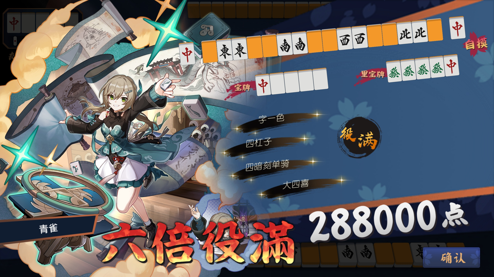

# 使用雀魂Plus更改角色立绘为第三方立绘

下载并安装该issue下版本的雀魂Plus: https://github.com/MajsoulPlus/majsoul-plus/pull/128#issuecomment-873089143

下面分为两部分内容: "加载自制牌谱插件"和"替换立绘"

## 加载自制牌谱插件

1. 运行雀魂Plus, 来到这个界面, 记住这两个按钮(按钮1 和 按钮2)

   

2. 点两次"按钮1", 弹出两次 extension 目录, 随便选择一个, 返回到上一级 Majsoul Plus 目录, 并找到 static 文件夹进入

3. 编辑牌谱
   1) 打开 [script.js](replayEditor/script.js), 该文件分为两个部分, 用一行 "=" 分开, 这一行上面的就是 main.js 中的内容, 下面的是自制牌谱内容
   2) 编辑牌谱只需要把原来的牌谱替换成要放映的牌谱就行, 注意牌谱的"主角"使用的立绘需要为你上面要替换的立绘
   3) **如果还要加载其他脚本(如 guobiao.js)**, 则要把该部分内容复制到 script.js 的 main.js 部分后面
4. 导入牌谱
   1) 编辑完成后, 复制 [replayEditor](replayEditor) 文件夹, 粘贴到上面 extension 目录中
   2) 点一次"按钮2", 会多一个插件, 如下图, 说明导入成功, 启用该插件

   

## 替换立绘

1. 雀魂Plus启动游戏登录小号, 在仓库中查看你要被替换的立绘(以"八木唯-异想烂漫"为例), 然后关闭重新打开雀魂Plus
   - 注意: 要被替换的立绘和新立绘最好尺寸比例差不多, 否则会拉伸变形, "八木唯-异想烂漫" 的长宽大约是最接近1:1的

2. 替换立绘(由于雀魂Plus的替换立绘功能失效了, 这里只能手动替换, 详见: https://github.com/MajsoulPlus/majsoul-plus/issues/158)
   1) 转到上面 static 文件夹, 进入 "0" 文件夹, 下面有很多后缀为 "w" 的文件夹, 通过搜索角色拼音的方式找到你要替换立绘的文件位置
   2) "八木唯-异想烂漫"在 `\v0.11.82.w\lang\base\extendRes\charactor\bamuwei_SLO`, 将该位置添加到地址栏后面, 可以直接定位
   3) 上面第3步查看立绘成功的话, 该 bamuwei_SLO 目录下有个 `full.png` 的文件, 这个就是"八木唯-异想烂漫"的全身立绘文件, 换成你的立绘

3. 雀魂Plus启动游戏, 查看牌谱, 即可查看到自制牌谱, 放映到报菜名界面, 即可查看到立绘改变
   - 注意头像的角色没有变化, 因为头像用的是另一个图片名 `smallhead.png`, 如无需求可以不改, 

   

## 其他注意事项

- 更改牌谱, 需要编辑位于 `extension\replayEditor` 的 script.js 的牌谱内容部分, 然后重启游戏 
- 更换立绘不需要重启游戏, 但需要注意备份, 或者使用完毕结束后删除你的文件, 后面会重新下载

更多第三方立绘展示详见我的B站动态: [把其他立绘搬到雀魂中](https://www.bilibili.com/opus/1056869246845321238)

## 其他相关文档

[报菜名界面加入无法显示的汉字](报菜名界面加入无法显示的汉字.md)
