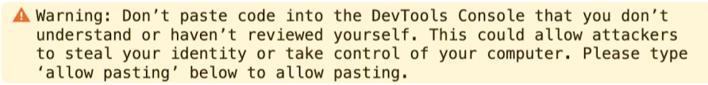

# 雀魂回放编辑器Majsoul_Replay_Editor

自定义雀魂牌谱回放的注入脚本和一些自制牌谱回放文件, 支持国际中文服, 日服和美服的网页端

[中文服官网](https://www.maj-soul.com), [日服官网](https://mahjongsoul.com), [美服官网](https://mahjongsoul.yo-star.com)

B站视频教程(偏过时): [【雀魂】如何自制牌谱回放](https://www.bilibili.com/video/BV1tJ6xY4E16)

## 免责声明: 由于这属于第三方脚本, 猫粮可能发威封号, 使用时请用小号登录实验, 个人对任何因封号等导致的损失概不负责

账号被封的话可以用账号邮箱发邮件给猫粮(中文服是 **cs@catfoodstudio.com** 或 **cs@maj-soul.com**), 申请注销账号,
对面发了确认通知后回复一下, 15天之后就可以重新使用该邮箱注册了

## 使用方法

### 快速上手

打开 [main.js](main.js) 和 [examples](examples) 文件夹或 [products](products)
文件夹下的任一牌谱回放js文件(如 [demo.js](examples/demo.js))

电脑登录网页版雀魂(注意用小号), F12 打开 console (控制台), 把 main.js 里面的内容全选复制输入到控制台中,
然后将牌谱回放js文件内容也输入到控制台中

(注: 如果在粘贴到控制台的时候出现了下图中的警告, 则需要先输入 `allow pasting`, 再输入上述脚本)

在网页版雀魂里随便选择一个牌谱打开, 就可以看到自制的牌谱了

### 自制教程

上面是简单的使用教程, 具体的修改教程要看下面的文档

原仓库用 [wiki](https://github.com/GrandDawn/majsoul-replay-editor/wiki) 的方式当做文档,
这里为了维护方便就把文档放到 [doc](doc) 文件夹下面了

建议阅读顺序:

1. [编辑游戏信息](doc/1_编辑游戏信息.md)
2. [编辑每个小局](doc/2_编辑每个小局.md)
3. [对局操作相关函数](doc/3_对局操作相关函数.md)
4. [(可选)对局操作相关函数(活动场)](doc/4_对局操作相关函数（活动场）.md)
5. [(可选)部分进阶功能](doc/5_部分进阶功能.md)
6. [(可选)推荐使用变量函数汇总](doc/6_推荐使用变量函数汇总.md)
7. [(可选)其他杂项信息](doc/7_其他杂项信息.md)

[字典](doc/0_字典.md) 是用来查阅的, 建议编辑牌谱时使用, [字典_template](doc/字典_template.md) 是生成字典的模版, 无需阅读

至于 code.js , 这是初步解混淆后的雀魂核心js文件, 与本仓库关系不大, 放在这里仅方便查阅(文件很大, 不要轻易打开),
解混淆的方法见另一个仓库: [misc-code](https://github.com/Fat-pig-Cui/misc-code)

使用过程中, 如果存在 bug 之类的不符合预期的情况, 可以提 issue,
或在B站联系我: [肥pig崔的B站空间](https://space.bilibili.com/372365985),
内容比较多的话还可以发邮件到我的邮箱说明: **chubbypig@qq.com**

另外, 如果有意向编写自制牌谱并且关注新功能, 或者做贡献, 则可以 fork 本仓库, 方便版本控制

## 功能概述

1. 立直麻将目前支持以下规则: (雀魂中的规则都有实现)
    - 段位场三四麻规则
    - 常驻活动场规则
        - [修罗之战](products/4P/修罗之战相关)
        - [赤羽之战(川麻)](products/4P/赤羽之战相关)
    - [其他活动场规则](products/其他活动场特殊规则)
        - [宝牌狂热](products/其他活动场特殊规则/宝牌狂热)
        - [配牌明牌](products/其他活动场特殊规则/配牌明牌)
        - [龙之目玉](products/其他活动场特殊规则/龙之目玉)
        - [明镜之战](products/其他活动场特殊规则/明镜之战)
        - [暗夜之战](products/其他活动场特殊规则/暗夜之战)
        - [幻境传说](products/其他活动场特殊规则/幻境传说)
        - [占星之战](products/其他活动场特殊规则/占星之战)
        - [天命之战](products/其他活动场特殊规则/天命之战)
        - [咏唱之战](products/其他活动场特殊规则/咏唱之战)
        - [魂之一击](products/其他活动场特殊规则/魂之一击)
        - [万象修罗](products/其他活动场特殊规则/万象修罗)
        - [背水之战](products/其他活动场特殊规则/背水之战)
    - 友人房规则:
        - 古役(包括一番街的, 详见 products 文件夹下的 [古役专题](products/古役专题))
        - 赤宝牌数量(支持全赤)
        - 食断
        - 番缚
        - 负分立直
        - 有无自摸损(三麻)
        - 是否公开手牌
    - 比赛场规则:
        - 自定义立直供托
        - 自定义本场点数
        - 自定义罚符
        - 切上满贯
        - 头跳
        - 是否人和满贯
        - 无大三元大四喜包牌
        - 四杠子包牌
        - 有无流局满贯
        - 有无一发
        - 是否连风4符
        - 是否有表宝牌, 里宝牌, 杠表宝牌, 杠里宝牌
        - 杠表宝牌即翻
        - 三家和了流局
        - 有无累计役满(即最高三倍满)
        - 有无双倍役满(天凤规则: 大四喜, 四单, 纯九, 十三面算单倍役满, 但复合役满仍有效)
        - 有无国士无双枪暗杠
    - 其他规则
        - 包杠
        - 青天井模式(谨慎使用, 高打点时很容易崩溃)
        - 有无振听
        - 无役诈和

2. 在 [add_function.js](add_function.js) 中提供了以下几种雀魂没有的模式, 详见 products
   文件夹下的 [自制模式](products/自制模式), 但该文件维护很困难, bug 可能比较多
    - [二人麻将](products/自制模式/二人麻将)
    - [开立直](products/自制模式/开立直)
    - [血流成河](products/自制模式/血流成河)

3. 在 main.js 中还提供了国标模式, 但本人没有打过一把国标, 可能有 bug, 详见 products
   文件夹下的 [国标麻将](products/国标麻将)

4. 对于不符合要求的填写, 可能出现页面崩溃的问题(一般页面会卡住, 控制台会报错)

5. 更多牌谱详见 [products](products) 文件夹, 也欢迎读者根据灵感制作自己的牌谱

## TODO(欢迎contribute)

- 关于GUI(图形化用户界面): 有玩家反馈写代码门槛过高, 能否搞个GUI. 但目前有以下因素导致短期内无法实现:
    - 核心脚本的代码很少考虑健壮性, 而且很难保证稳定性
    - 核心脚本功能过于复杂, 即使做GUI了还是要读上面的文档才能学会使用
    - 做GUI所花费的精力要比脚本大的多
    - 个人对GUI方面不是很熟
    - 总结: "好钢用在刀刃上", GUI上下功夫性价比太低, 但仍然欢迎大佬实现GUI

## 版权声明

1. 更改回放的方法参考了B站 [一般通过转转](https://space.bilibili.com/23019265)
   的 [【雀魂+】(自制回放)听说有人想看石上三年的七倍役满](https://www.bilibili.com/video/BV1HE411Q7JM)

2. 血流成河的某些功能同样参照了上述作者的
   [雀魂麻将脚本](https://greasyfork.org/zh-CN/scripts/423689-%E9%9B%80%E9%AD%82%E9%BA%BB%E5%B0%86%E8%84%9A%E6%9C%AC)

3. 有少部分代码来自雀魂网页端源码, 特别感谢猫粮工作室老板娘"丝茉茉"的鼎力相助

4. 其他部分由两位作者共同编写, 具体贡献:
    - [GrandDawn](https://github.com/GrandDawn) (原作者):
        - main.js 核心功能的算法实现
        - add_function.js 重写函数的算法实现
        - 说明文档(wiki)的编写
        - 示例牌谱的编写
    - [Fat-pig-Cui](https://github.com/Fat-pig-Cui) (我, 维护者):
        - main.js 的重构, 添加 JSDoc, 功能的大量扩充(包括国标功能的实现)
        - add_function.js 的维护与扩充
        - 说明文档的重排优化, 细节补充
        - 自制牌谱的大量补充, 及批处理脚本刷新牌谱的编写

   目前原作者已很少接触雀魂, 故相关问题尽量找我

5. Github 是本仓库唯一的发布平台, 开源协议 Apache 2.0

## 演示截图

- [demo.js](examples/demo.js)
  
- 段位场四麻理论最高番数
  
- [【雀魂自制牌谱】一姬纯享版报菜名 升级版](https://www.bilibili.com/video/BV1w96LYWEzR)
  
- 天才麻将少女 名对局 宫永咲VS天江衣
  
- MLeague 名场面 佐佐木寿人死亡二则
  
- 真·字一色 (注意: 这里更改立绘使用到了 [雀魂Plus](https://github.com/MajsoulPlus/majsoul-plus), 自制牌谱只实现了牌谱部分,
  教程见 [README.md](using_MJSP/README.md))
  
- 国标麻将不算花牌情况下理论最大牌型(有些番种名称无法正常显示的问题通过 Majsoul Plus 解决了,
  详见 [报菜名界面加入无法显示的汉字](using_MJSP/报菜名界面加入无法显示的汉字.md))
  
- 立直麻将版血流成河模式
  
