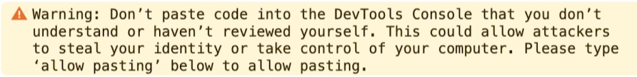
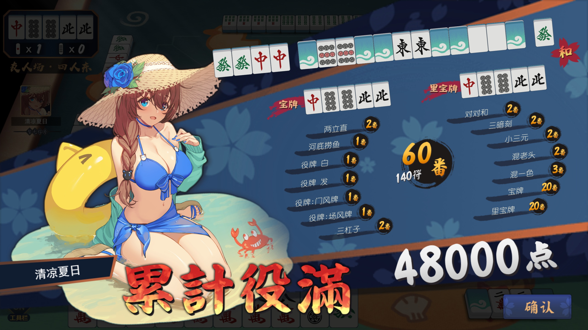
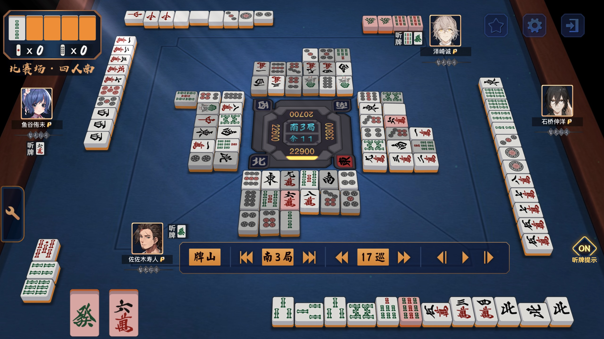

# Majsoul Replay Editor (雀魂回放编辑器)

[中文](README.md) | English

Injection scripts for custom Majsoul replay files, plus a collection of user-made replay scripts. Works on the Majsoul web client for CN / JP / US regions.

- CN: https://www.maj-soul.com
- JP: https://mahjongsoul.com
- US: https://mahjongsoul.yo-star.com

Bilibili video tutorial (somewhat outdated): https://www.bilibili.com/video/BV1tJ6xY4E16

## Disclaimer

This is a third-party script. The operator (Catfood Studio) may ban accounts. Please log in with a test/secondary account when experimenting. The maintainer is not responsible for any losses caused by bans or other risks.

If your account is banned, you may request account deletion via email (CN servers: **cs@catfoodstudio.com** or **cs@maj-soul.com**). After receiving the confirmation email, reply to it; 15 days later you can register again using the same email.

## Usage

### Quick start

Open [main.js](main.js) and any replay JS file under [examples](examples) or [products](products) (for example: [demo.js](examples/demo.js)).

On a computer, log into Majsoul Web (use a test account). Press F12 to open DevTools → Console. Copy-paste the entire contents of `main.js` into the console and execute it. Then copy-paste the replay script and execute it as well.

Note: If you see the warning shown below when pasting into the console, you need to type `allow pasting` first (or `允许粘贴` in Chinese), then paste the scripts.

Now open any replay on the site, and you should see the custom replay.

### Authoring guide

The section above is enough for running examples. For detailed editing, read the docs below.

The original repository used GitHub Wiki as documentation. For easier maintenance, the docs have been moved into the [doc](doc) folder.

Recommended reading order:

1. [Edit game information](doc/1_编辑游戏信息.md)
2. [Edit each round](doc/2_编辑每个小局.md)
3. [Operation functions](doc/3_对局操作相关函数.md)
4. (Optional) [Operation functions (Event modes)](doc/4_对局操作相关函数（活动场）.md)
5. (Optional) [Advanced features](doc/5_部分进阶功能.md)
6. (Optional) [Recommended variables and helpers](doc/6_推荐使用变量函数汇总.md)
7. (Optional) [Miscellaneous](doc/7_其他杂项信息.md)

[Dictionary](doc/0_字典.md) is for quick look-ups while authoring replays. [字典_template](doc/字典_template.md) is a template used to generate the dictionary and does not need to be read.

---

To make maintenance and encapsulation easier, the project is currently being rewritten in TypeScript. The current `main.js` is compiled from the TypeScript files under [src](src).

An older version is kept here temporarily: [main_old.js](main_old.js)

How to compile from TS to JS:

1. Install Node.js and npm
2. Run `npm install` at the project root to install dependencies
3. Run `npm run build` to regenerate (overwrite) `main.js`

If you find bugs or behavior that doesn't match expectations, feel free to open an issue. You can also contact me on Bilibili: https://space.bilibili.com/372365985

If you'd like to author custom replays and follow new features, or contribute to the project, you can fork this repo to make version control easier.

## Features overview

1. Riichi Mahjong currently supports the following rules/features (everything available in Majsoul is implemented):
   - Ranked (Dan) 3-player / 4-player rules
   - Permanent event rules:
     - [Shura Battle](products/4P/修罗之战相关)
     - [Akaba Battle (Sichuan Mahjong)](products/4P/赤羽之战相关)
   - [Other special event rules](products/其他活动场特殊规则):
     - [Treasure Tiles Frenzy](products/其他活动场特殊规则/宝牌狂热)
     - [Dealt-open-hand](products/其他活动场特殊规则/配牌明牌)
     - [Dragon Eye](products/其他活动场特殊规则/龙之目玉)
     - [Mirror Battle](products/其他活动场特殊规则/明镜之战)
     - [Night Battle](products/其他活动场特殊规则/暗夜之战)
     - [Illusion Legend](products/其他活动场特殊规则/幻境传说)
     - [Astrology Battle](products/其他活动场特殊规则/占星之战)
     - [Fate Battle](products/其他活动场特殊规则/天命之战)
     - [Chanting Battle](products/其他活动场特殊规则/咏唱之战)
     - [Soul Strike](products/其他活动场特殊规则/魂之一击)
     - [Ten Thousand Changes Shura](products/其他活动场特殊规则/万象修罗)
     - [Last Resort](products/其他活动场特殊规则/背水之战)
     - [Rise to the Top](products/其他活动场特殊规则/下克上)
   - Friendly room rules:
     - Ancient-yaku variants (see [古役专题](products/古役专题))
     - Number of red dora (supports all-red)
     - Kuitan (open tanyao)
     - Fan requirement (minimum han)
     - Riichi allowed below 0 points
     - Tsumo point-loss toggle (3-player)
     - Option to reveal all hands
   - Tournament rules:
     - Custom riichi sticks (deposit)
     - Custom honba points
     - Custom penalty (chombo) points
     - Kiriage mangan
     - Atamahane (head-bump)
     - Renhou treated as mangan
     - Disable responsibility payments for Big Three Dragons / Big Four Winds
     - Responsibility payment for Four Kans
     - Nagashi mangan toggle
     - Ippatsu toggle
     - 4 fu for double-wind pairs toggle
     - Dora/ura-dora/kandora toggles
     - “Kandora flips immediately” toggle
     - Triple ron abortive draw
     - Accumulated yakuman toggle (max: triple mangan)
     - Double-yakuman toggle (Tenhou-style: Big Four Winds, Four Concealed Single Wait, Pure Nine Gates, 13-sided Kokushi are treated as single yakuman; combined yakuman still apply)
     - Kokushi ron on ankan toggle
   - Other rules:
     - Kong responsibility (包杠)
     - Aotenjou mode (not recommended; may crash at very high scores)
     - Furiten toggle
     - No-yaku false-win handling

2. [add_function.js](add_function.js) provides several modes that do not exist in the official client (see [自制模式](products/自制模式)). This file is hard to maintain, and may contain bugs.
   - [2-player Mahjong](products/自制模式/二人麻将)
   - [Open Riichi](products/自制模式/开立直)
   - [Blood Flow](products/自制模式/血流成河)

3. `main.js` also provides a Chinese National Standard (Guobiao) mode. I haven't played Guobiao myself, so there may be bugs. See [国标麻将](products/国标麻将).

4. Invalid inputs may crash the page (usually it freezes and the console reports errors).

5. More replays can be found under [products](products). You’re welcome to create your own.

## TODO (contributions welcome)

- Modularization: The current structure is somewhat messy. A refactor into a more modular design would help maintenance and extensions, but I haven’t found a suitable approach yet. It needs time for design and implementation.

- GUI (Graphical User Interface): Some users asked for a GUI to lower the barrier to writing scripts, but it’s unlikely in the short term because:
  - The core script doesn’t focus much on robustness, and stable behavior is hard to guarantee.
  - The core features are complex; even with a GUI you’d still need to read the docs.
  - GUI development effort is far larger than script work.
  - I’m not very familiar with GUI development.

Summary: “Spend effort where it matters.” A GUI offers low ROI right now, but contributors are welcome to implement it.

## Copyright / Credits

1. Some replay-modification methods referenced a Bilibili author: [一般通过转转](https://space.bilibili.com/23019265)
   - [【雀魂+】(自制回放)听说有人想看石上三年的七倍役满](https://www.bilibili.com/video/BV1HE411Q7JM)

2. Some Blood Flow features also referenced the above author’s Majsoul script:
   - https://greasyfork.org/zh-CN/scripts/423689-%E9%9B%80%E9%AD%82%E9%BA%BB%E5%B0%86%E8%84%9A%E6%9C%AC

3. A small portion of code comes from the Majsoul web client source. Special thanks to Catfood Studio’s producer “丝茉茉” for the support.

4. Contributors:
   - [GrandDawn](https://github.com/GrandDawn) (original author)
     - Algorithm implementation for the core features in `main.js`
     - Algorithm implementation for rewritten functions in `add_function.js`
     - Wiki documentation
     - Example replays
   - [Fat-pig-Cui](https://github.com/Fat-pig-Cui) (maintainer)
     - TypeScript refactor of `main.js`, added TSDoc, and major feature expansions (including Guobiao mode)
     - Maintenance and expansion of `add_function.js`
     - Documentation restructuring and additions
     - Many custom replays and batch scripts for updating replays

5. GitHub is the only release platform. License: Apache 2.0 (see [LICENSE](LICENSE)).

## Screenshots

- [demo.js](examples/demo.js)
  
- Theoretical max han in ranked 4-player Riichi
  
- [【雀魂自制牌谱】一姬纯享版报菜名 升级版](https://www.bilibili.com/video/BV1w96LYWEzR)
  
- Saki: famous match scene (Miyanaga Saki vs Amae Koromo)
  
- M-League: famous scene (Sasaki Hisato “death” compilation)
  
- True “All Honors” (note: this uses [MajsoulPlus](https://github.com/MajsoulPlus/majsoul-plus) to change character portraits; this custom replay only implements the replay part. See [using_MJSP/README.md](using_MJSP/README.md))
  
- Guobiao theoretical max hand without flowers (some hand names can’t display normally; solved via MajsoulPlus — see [报菜名界面加入无法显示的汉字](using_MJSP/报菜名界面加入无法显示的汉字.md))
  
- Riichi-style Blood Flow mode
  
