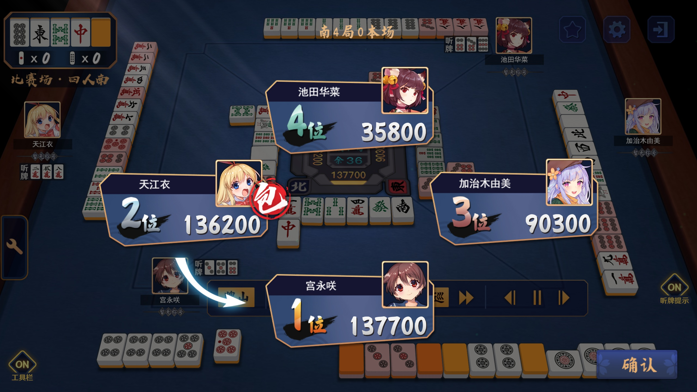

# Majsoul Replay Editor (雀魂 Replay Editor)

**Updated on January 3, 2026**

[中文](README.md) | English (this file)

Injection scripts for custom Majsoul replay files and a collection of user-made replay files. Works on the Majsoul web client for CN, JP and US regions:

- CN: https://www.maj-soul.com
- JP: https://mahjongsoul.com
- US: https://mahjongsoul.yo-star.com

Bilibili tutorial (somewhat outdated): https://www.bilibili.com/video/BV1tJ6xY4E16

## Disclaimer
This is a third-party script. Game operators may ban accounts. Use a secondary account for testing. The author is not responsible for any losses (including bans) caused by using these scripts.

If your account is banned you can request account deletion by emailing the game team (CN servers: cs@catfoodstudio.com or cs@maj-soul.com). After they reply with confirmation you can reuse the email to register a new account after 15 days.

## Usage

### Quick start

Open `main.js` and any replay JS file from `examples/` or `products/` (for example `examples/demo.js`).

Log into Majsoul with a browser (use a test account), open DevTools (F12) and paste the entire contents of `main.js` into the Console first, then paste your chosen replay script.

If the console blocks pasting, first type `allow pasting` (or Chinese `允许粘贴`) and press Enter, then paste the scripts. See `doc/pic/allow_pasting.jpg` for a screenshot.

Open any replay on the site and your custom replay will appear.

### Authoring custom replays

The quick method above is enough to run examples. For detailed editing, read the documentation files in `doc/` in the recommended order:

1. `doc/en/1_GameInfo.md` (Edit game information)
2. `doc/en/2_RoundInfo.md` (Edit each round)
3. `doc/en/3_OperationFunc.md` (Operation functions)
4. `doc/en/4_EventOperationFunc.md` (optional: event-specific operations)
5. `doc/en/5_AdvancedFeatures.md` (optional: advanced features)
6. `doc/en/6_VariablesAndHelpers.md` (optional: recommended variables and helpers)
7. `doc/7_其他杂项信息.md` (optional: miscellaneous)

Use `doc/0_字典.md` as a reference dictionary. `doc/字典_template.md` is a template for generating dictionaries and does not need to be read.

`code.js` is a partially deobfuscated Majsoul core JS file included for reference only (it's very large; avoid opening casually). The deobfuscation method is described in the `misc-code` repository.

The project is being migrated to TypeScript. Current `main.js` and `main.d.ts` are compiled from `main.ts`. Some TypeScript/JS errors are expected because parts borrow official site code (notably `GameMgr.Inst.checkPaiPu` and `optimizeFunction`). An older version is available as `main_old.js`.

If you encounter bugs, open an issue or contact the maintainer via Bilibili: https://space.bilibili.com/372365985

If you plan to write custom replays or contribute, please fork the repository for easier version control.

## Features overview

1. Riichi Mahjong support (implements Majsoul rules), including:
   - Ranked (4p/3p) rules
   - Permanent event rules such as:
     - Shura Battle (`products/4P/修罗之战相关`)
     - Akaba Battle (Sichuan Mahjong) (`products/4P/赤羽之战相关`)
   - Other event modes (`products/其他活动场特殊规则`) including Treasure Tiles Frenzy, Dealt-open-hand, Dragon Eye, Mirror Battle, Night Battle, Illusion Legend, Astrology Battle, Fate Battle, Chanting Battle, Soul Strike, Ten Thousand Changes Shura, Last Resort, and more (see `products/` for details).
   - Friendly room options: ancient-yaku variations, red-dora counts (supports all-red), shiduan and fan-fu settings, negative-point riichi, tsumo-penalty toggles (3p), open-hand toggle.
   - Tournament options: custom riichi handling, custom honba/starting points, custom penalties, qieshang mangan, head-jump, renhu as mangan, disable certain bao-pai rules, gang- and dora-related toggles, sanjiahule abortive draw, accumulated yakuman toggles, double-yakuman handling, guoshi ankan restrictions, etc.
   - Other features: bao-gang (kong liability), Qingtianjing mode (use with caution), optional furiten behavior, false-hu modes.

2. `add_function.js` provides several modes not present in the official client (see `products/自制模式`), though this file is hard to maintain and may contain bugs:
   - Two-player Mahjong (`products/自制模式/二人麻将`)
   - Open Riichi (`products/自制模式/开立直`)
   - Blood Flow mode (`products/自制模式/血流成河`)

3. A Chinese National Standard (Guobiao) mode exists in `main.js` (untested extensively; may contain bugs). See `products/国标麻将`.

4. Improper inputs may crash or freeze the page (console errors may appear).

5. More custom replays are available under `products/`. Contributions welcome.

## TODO (contributions welcome)

- GUI: Several users requested a GUI to lower the barrier to entry, but short-term implementation is unlikely due to:
  - The core script lacks robustness and is hard to guarantee stable behavior.
  - The script's complexity means a GUI would still require reading docs.
  - GUI development effort is larger than script work.
  - The maintainer has limited GUI experience.

Summary: Low short-term ROI for a GUI, but PRs and contributions are welcome.

## Copyright / Credits

1. Some methods and techniques are referenced from a Bilibili author ("转转"). See linked video for details.

2. Some Blood Flow features reference the above author's Majsoul script on Greasy Fork.

3. Small portions of code are copied from the Majsoul web client source — thanks to the studio.

4. Main contributors:
   - GrandDawn (original author): core algorithms in `main.js`, `add_function.js` logic, wiki documentation, example replays.
   - Fat-pig-Cui (maintainer): TypeScript refactor of `main.js`, added TSDoc, major feature expansions (including Guobiao), maintenance and expansion of `add_function.js`, documentation reorganization and additions, many custom replays and batch scripts.

5. GitHub is the only release platform. License: Apache-2.0.

## Screenshots / Demos

- `examples/demo.js` (demo screenshot)
  
- Theoretical max han in 4-player ranked
  
- Custom replay demo (video)
  
- Famous match examples
  
- M-League highlight
  
- Pure Kana (note: this demo uses MajsoulPlus for portrait changes; replay only covers the hand data — see `using_MJSP/README.md`)
  
- Guobiao theoretical max hand without flower tiles
  
- Riichi-style Blood Flow mode demo
  
