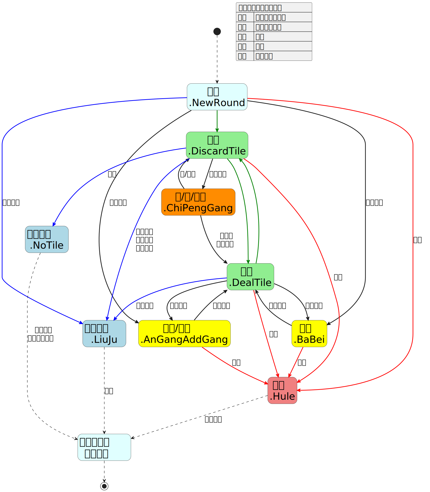
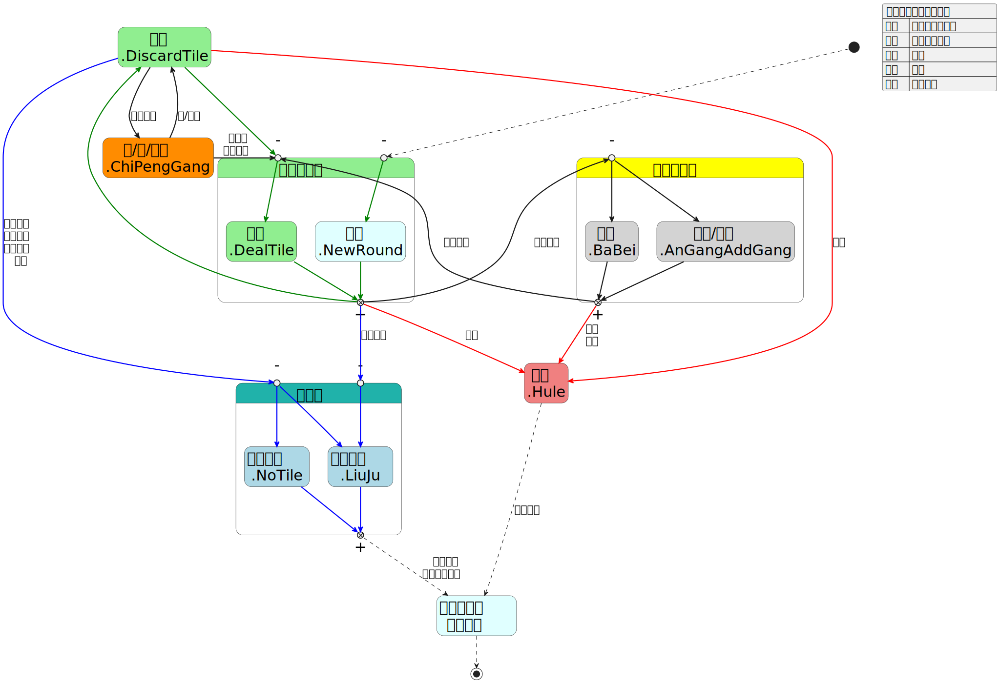

# 对局操作相关函数

## 段位场操作状态转移表

该图是由 [plantuml](https://plantuml.com/zh) 生成的 svg 图, 官方函数版的图和代码在最后


## 摸牌

`mopai(seat, tile)`

`seat` : `seat` 号玩家摸牌, 没有此参数时由系统判断哪位玩家摸牌, 是否为岭上摸牌也由系统自动判断

若系统无法判断谁摸牌, 则在控制台会有报错

`tile` : 摸的牌, 没有此参数时将根据牌山确定

实际摸的牌按照以下优先级顺序确定

1. 给 `tile` 赋值的牌
2. `setDealTiles` 的参数中 `seat` 号玩家的摸牌顺序
3. 据牌山推断应该摸的牌

**注意: 设定 `tile` 后, 摸的牌与牌山对应的不一致是可以的(类似自己另带牌出千换牌), 但会破坏牌谱完整性,
如无法正确检查各种牌数量是否合规**

例子: `mopai(1);` 和 `mopai('1z');`

## 切牌

`qiepai(seat, tile, is_liqi, f_moqie)`

`seat` : `seat` 号玩家切牌, 没有此参数时由系统判断哪位玩家切牌

`tile` : 表示要切的牌, 若没有该参数, 则为摸切

当要切的牌既可以手切又可以摸切时:

- 若是通过 `setDiscardTiles` 获取的牌, 则为摸切
- 若不是通过 `setDiscardTiles`, 则手动给参数 `tile` 赋值表示手切, 不赋值表示摸切

实际切的牌按照以下优先级顺序确定

1. 给 `tile` 赋值的牌
2. `setDiscardTiles` 的参数中 `seat` 号玩家的切牌顺序
3. 摸切(切最后摸到的牌)

若系统判断切牌家没有 `tile` 牌, 则在控制台会有报错

`is_liqi` : 表示这次切牌是否立直(`true` 或 `false`), 由系统判断是否为双立直, 若则参数为 `'kailiqi'`, 则为开立直
(需要导入 [add_function.js](../add_function.js) 实现), 没有此参数时默认不立直

在 `detail_rule` 中没有设置 `_fufenliqi` 时, 点数不够的情况下 `is_liqi` 设置为 `true` 会立直失败

`f_moqie` : 仅在何切模式(`detail_rule` 中设置 `_heqie_mode`)下有效, 值为 `'moqie'` 时, 表示强制显示摸切

例子: `qiepai('0m', true);` 和 `qiepai(3);`

## 鸣牌(吃/碰/明杠)

`mingpai(seat, tiles)`

吃/碰/明杠 都是**其他家摸牌并切牌**后的鸣牌操作

`seat` : `seat` 号玩家吃/碰/明杠, 没有此参数时由系统判断哪位玩家吃/碰/明杠

`tiles` : 鸣牌家从手里拿出的牌, 没有此参数时按照是否可以"明杠, 碰, 吃"的顺序判断, 且优先使用红宝牌和特殊牌

若没有玩家能够 `mingpai`, 则在控制台会有报错

例子: `mingpai(3, '46m');` 和 `mingpai('055s');`

## 鸣牌(暗杠/加杠/拔北)

`zimingpai(seat, tile, type)`

暗杠/加杠/拔北 都是**自家摸牌**后的鸣牌操作

`seat` : `seat` 号玩家暗杠/加杠/拔北, 没有此参数时由系统判断哪位玩家暗杠/加杠/拔北

`tile` : 要暗杠/加杠/拔北的牌, 没有此参数时按照是否可以"拔北, 暗杠, 加杠"的顺序判断

`type` : 即操作类型, 暗杠/加杠/拔北 分别为 `'angang'`/`'jiagang'`/`'babei'`,
没有此参数时按照是否可以"拔北, 暗杠, 加杠"的顺序判断

若玩家无法 `zimingpai`, 则在控制台会有报错

例子: `zimingpai(0, '1m');` 和 `zimingpai('4z', 'angang');`

## 和牌

`hupai(all_seats)`

表示 `all_seats` 内所有的玩家和牌, 没有此参数时由系统判断哪些玩家可以和牌

此外, 如果仅有一位玩家和牌, `all_seats` 也可以直接设置为数字

若没有参数 `all_seats` 且在荣和情况下没有玩家可以正常和牌时, 则在控制台会有报错

若设置了头跳且 `all_seats` 不止一位玩家时, `all_seats` 中只有最靠近放铳位的玩家会和牌

例子: `hupai(0);` 和 `hupai([1, 2, 3]);`

**无役, 振听及非和牌型的情况**:

- 若为自摸和牌, 则使用该函数时会强制该玩家和牌, 无论是否能和, 无役或非和牌型则为诈和
- 若为荣和和牌
    - 没有参数 `all_seats` 时, 无役和振听的玩家将不能和牌
    - 有参数 `all_seats` 时, 会根据 `all_seats` 中的玩家是否能和进行判断是否为诈和
- 荣和和牌的两种情况可以设置 `detail_rule` 中的参数来进行修改
    - `_ronghuzhahu`: 若为 `true`, 则没有参数 `all_seats` 时, 无役的听牌玩家会和牌, 但是是诈和. 默认为 `false`
    - `_no_zhenting`: 若为 `true`, 则为无振听模式, 此时振听的玩家会和牌, 且可以正常结算番数, 默认为 `false`

## 荒牌流局

`huangpai()`

即使牌没有摸完也可以调用(在几乎任何情况下都可以调用)

## 途中流局

`liuju(liuju_type)`

`liuju_type` 表示途中流局的种类:

- 1: 九种九牌
- 2: 四风连打
- 3: 四杠散了
- 4: 四家立直
- 5: 三家和了(需要在 `detail_rule` 中设置 `_sanxiangliuju`)

若没有该参数, 则除了"三家和了"外, 由系统自动判断属于哪种流局(即"三家和了"目前只能通过手动输入参数的方式实现)

若同时满足多种流局, 则优先级为: 四风连打 > 四杠散了 > 四家立直

调用前四种流局的话, 无论是否有参数, 都需要满足流局对应的条件, 否则会不起作用, 在控制台有报错提示

---

## 跳转局数

`setRound(c, j, b)`

这个函数用于跳转到对应的对局, 三个参数分别对应 `chang`, `ju`, `ben` (在 `randomPaishan` 那里讲过)

比如东一局结束之后想马上进到南一局, 那就在东一局后面调用 `setRound(1, 0, 0);`, 就能立刻进入南一局

注意这个不能修改刚进牌谱的第一局, 若要修改第一局需要使用 `detail_rule` 中的 `_chang_ju_ben_num_`,
若值为 `[1, 3, 5]`, 则表示刚进入对局的第一局为"南4局5本场"

## 当前牌山剩余牌数

`getLeftTileCnt()`

返回当前位置牌山还剩余多少牌可以摸

另外还有几个开局显示的剩余牌数

- 69: 四麻段位场
- 54: 三麻段位场
- 55: 赤羽之战
- 83: 国标麻将
- 35: 二人麻将

## 专用函数: 示例对局

`demoGame()`

在 [预设模版](../products/预设模版) 里面用来展示的小局(会根据 `config` 中的设置自动判断对局人数)

---

## 便捷函数一览


## 便捷函数: 正常摸切

`normalMoqie(tile_cnt)`

函数内容只有 `mopai()` 和 `qiepai()` 的循环, 用于切牌数量较多的情况, `tile_cnt` 是摸牌之后所要切的牌或者是循环次数

即若 `tile_cnt`

- 是一张牌, 如 '1p', 则表示 `qiepai()` 中的 `tile` 参数, 即要切的牌, 例: `normalMoqie('1p');`
- 是数字, 则表示 `mopai()` 和 `qiepai()` 的循环次数, 例: `normalMoqie(2);`
- 没有值, 则等同于上述数字为1

与 `setDiscardTiles` 配合使用可以代替无人鸣牌情况下的冗长而杂乱的切牌

## 便捷函数: 摸牌立直

`moqieLiqi(tile_cnt)`

函数内容只有 `mopai()` 和 `qiepai(true)`, 其中 `tile_cnt` 与 `normalMoqie` 中的含义完全一致

## 便捷函数: 连续岭上摸牌

`comboMopai(tile_cnt)`

用于连续的岭上摸牌, 函数内容只有 `zimingpai()` 和 `mopai()` 的循环, `tile_cnt` 同上述

因为 `zimingpai()` 的判断顺序是"拔北, 暗杠, 加杠", 所以如果对顺序有要求, 则不应该用这个函数

例子: 连续杠四次 `comboMopai(4);`; 杠东风后摸牌 `comboMopai('1z');`

注意: 由于该函数最后会 `mopai()`, 所以之后紧跟着的函数不能是 `normalMoqie`, 因为会再次调用 `mopai()` 导致相公

## 便捷函数: 鸣牌并切牌

`mingQiepai(tls_cnt)`

函数内容只有 `mingpai()` 和 `qiepai()` 的循环, `tls_cnt` 比上述的 `tile_cnt` 含义更广

若 `tls_cnt`

- 是一张牌, 如 '1p', 则表示 `qiepai()` 中的 `tile` 参数, 即要切的牌
- 是至少两张牌, 如 "23m", 则表示 `mingpai()` 中的 `tiles` 参数, 即鸣牌家从手里拿出的牌, 例: `normalMoqie('35m');`
- 是数字, 则表示 `mingpai()` 和 `qiepai()` 的循环次数
- 没有值, 则等同于上述数字为1

这里的循环次数指的是多人 combo 鸣牌

由于 `mingpai()` 后紧跟着 `qiepai()`, 所以这里的 `mingpai()` 只能是吃或者碰, 不能是明杠

由于 `mingpai()` 不给参数时按照"明杠, 碰, 吃"的顺序判断, 而且"碰, 吃"可能也有分歧项, 故如果有对应要求, 则不应该用这个函数

其次 `qiepai()` 通常也有所指定, 故一般也与 `setDiscardTiles` 配合使用

## 便捷函数: 自摸和牌

`zimoHu(flag)`

函数内容只有 `mopai()` 和 `hupai()`, `flag` 是修罗赤羽中表示是否为最终和牌的 `true` or `false`, 可选, 默认为 `false`

## 便捷函数: 摸切到荒牌流局

`moqieLiuju()`

函数内容只有 `normalMoqie(cnt)` 和 `huangpai()`, 其中 `cnt` 即当前牌山剩余牌数 `getLeftTileCnt()`

## svg 图和 plantuml 代码

### 官方版本的段位场操作状态转移表





### plantuml 代码

段位场操作状态转移表

```plantumlcode
@startuml 段位场操作状态转移表
hide empty description
scale 1.5
skinparam defaultTextAlignment center
skinparam defaultFontName "微软雅黑"
skinparam DefaultFontSize 20
skinparam State { 
    FontSize 28
}

State "开局(庄行动)\nroundBegin()" as S1 #LightCyan
State "切牌\nqiepai()" as S2 #LightGreen
State "摸牌\nmopai()" as S3 #LightGreen
State "吃/碰/明杠\nmingpai()" as S4 #Yellow
State "暗杠/加杠/拔北\nzimingpai()" as S5 #Yellow
State "和牌\nhupai()" as S6 #LightCoral
State "荒牌流局\nhuangpai()" as S7 #LightBlue
State "途中流局\nliuju()" as S8 #LightBlue
State "本小局结束\n开始结算" as S9 #LightCyan

[*] -[dashed]-> S1

' 绿线: 无人鸣牌的流程
S1 -[#green,bold]-> S2
S2 -[#green,bold]-> S3
S3 -[#green,bold]-> S2

' 黑线: 鸣牌相关流程
S1 -[bold]-> S5 : 自家鸣牌

S2 -[bold]-> S4 : 他家鸣牌
S4 -[bold]-> S2 : 吃/碰后
S4 -[bold]-> S3 : 明杠后\n岭上摸牌

S3 -[bold]-> S5 : 自家鸣牌
S5 -[bold]-> S3 : 岭上摸牌

' 红线: 和牌
S1 -[#red,bold]-> S6 : 天和
S2 -[#red,bold]-> S6 : 放铳
S3 -[#red,bold]-> S6 : 自摸
S5 -[#red,bold]-> S6 : 枪杠\n枪北

' 蓝线: 流局
S2 -[#blue,bold]-> S7 : 荒牌
S2 -[#blue,bold]-> S8 : 四风连打\n四杠散了\n四家立直
S1 -[#blue,bold]-> S8 : 九种九牌
S3 -[#blue,bold]-> S8 : 九种九牌

' 终局
S6 -[dashed]-> S9 : 连庄判断
S7 -[dashed]-> S9 : 连庄判断\n流局满贯判断
S8 -[dashed]-> S9 : 连庄
S9 -[dashed]-> [*]

json 段位场操作状态转移表 {
    "绿线": "无人鸣牌的流程",
    "黑线": "鸣牌相关流程",
    "红线": "和牌",
    "蓝线": "流局",
    "虚线": "过渡流程"
}
@enduml
```

便捷函数一览

```plantumlcode
@startuml 便捷函数一览
hide empty description
scale 1.5
skinparam defaultTextAlignment center
skinparam defaultFontName "微软雅黑"
skinparam DefaultFontSize 20
skinparam State { 
    FontSize 28
}

State "正常摸切\nnormalMoqie()" as S1 #LightGreen {
    State "切牌\nqiepai()" as S12 #LightGreen
    State "摸牌\nmopai()" as S11 #LightGreen
    S11 -[#green,bold]-> S12
}

State "摸牌立直\nmoqieLiqi()" as S2 #LightGreen {
    State "摸牌\nmopai()" as S21 #LightGreen
    State "切牌\nqiepai(true)" as S22 #LightGreen
    S21 -[#green,bold]-> S22
}

State "连续岭上摸牌\ncomboMopai()" as S3 #YellowGreen {
    State "暗杠/加杠/拔北\nzimingpai()" as S31 #Yellow
    State "摸牌\nmopai()" as S32 #LightGreen
    S31 -[bold]-> S32
}

State "鸣牌并切牌\nmingQiepai()" as S4 #YellowGreen {
    State "吃/碰/明杠\nmingpai()" as S41 #Yellow
    State "切牌\nqiepai()" as S42 #LightGreen
    S41 -[bold]-> S42
}

State "自摸和牌\nzimoHu()" as S5 #LightCoral {
    State "摸牌\nmopai()" as S51 #LightGreen
    State "和牌\nhupai()" as S52 #LightCoral
    S51 -[#red,bold]-> S52
}

State "摸切到荒牌流局\nmoqieLiuju()" as S6 #LightGreen {
    State "正常摸切\nnormalMoqie(cnt)" as S61 #LightGreen
    State "荒牌流局\nhuangpai()" as S62 #LightBlue
    S61 -[#green,bold]-> S62
}
@enduml
```

段位场操作状态转移表_官方函数版

```plantumlcode
@startuml 段位场操作状态转移表_官方版
hide empty description
scale 1.5
skinparam defaultTextAlignment center
skinparam defaultFontName "微软雅黑"
skinparam DefaultFontSize 20
skinparam State { 
    FontSize 28
}

State "本小局结束\n开始结算" as S0 #LightCyan
State "开局\n.NewRound" as S1 #LightCyan
State "切牌\n.DiscardTile" as S2 #LightGreen
State "摸牌\n.DealTile" as S3 #LightGreen
State "吃/碰/明杠\n.ChiPengGang" as S4 #Darkorange
State "暗杠/加杠\n.AnGangAddGang" as S5 #Yellow
State "和牌\n.Hule" as S6 #LightCoral
State "途中流局\n.LiuJu" as S7 #LightBlue
State "荒牌流局\n.NoTile" as S8 #LightBlue
State "拔北\n.BaBei" as S9 #Yellow

[*] -[dashed]-> S1

' 绿线: 无人鸣牌的流程
S1 -[#green,bold]-> S2
S2 -[#green,bold]-> S3
S3 -[#green,bold]-> S2

' 黑线: 鸣牌相关流程
S1 -[bold]-> S5 : 自家鸣牌
S1 -[bold]-> S9 : 三麻拔北

S2 -[bold]-> S4 : 他家鸣牌
S4 -[bold]-> S2 : 吃/碰后
S4 -[bold]-> S3 : 明杠后\n岭上摸牌

S3 -[bold]-> S5 : 自家鸣牌
S5 -[bold]-> S3 : 岭上摸牌

S3 -[bold]-> S9 : 三麻拔北
S9 -[bold]-> S3 : 岭上摸牌

' 红线: 和牌
S1 -[#red,bold]-> S6 : 天和
S2 -[#red,bold]-> S6 : 放铳
S3 -[#red,bold]-> S6 : 自摸
S5 -[#red,bold]-> S6 : 枪杠
S9 -[#red,bold]-> S6 : 枪北

' 蓝线: 流局
S2 -[#blue,bold]-> S8 : 荒牌
S2 -[#blue,bold]-> S7 : 四风连打\n四杠散了\n四家立直
S1 -[#blue,bold]-> S7 : 九种九牌
S3 -[#blue,bold]-> S7 : 九种九牌

' 终局
S6 -[dashed]-> S0 : 连庄判断
S8 -[dashed]-> S0 : 连庄判断\n流局满贯判断
S7 -[dashed]-> S0 : 连庄
S0 -[dashed]-> [*]

json 段位场操作状态转移表 {
    "绿线": "无人鸣牌的流程",
    "黑线": "鸣牌相关流程",
    "红线": "和牌",
    "蓝线": "流局",
    "虚线": "过渡流程"
}
@enduml
```

段位场操作状态转移表_官方分组版

```plantumlcode
@startuml 段位场操作状态转移表_官方分组版
hide empty description
scale 1.5
skinparam defaultTextAlignment center
skinparam defaultFontName "微软雅黑"
skinparam DefaultFontSize 20
skinparam State { 
    FontSize 28
}

State "广义摸牌组" as S000 #LightGreen {
    State "开局\n.NewRound" as S1 #LightCyan
    State "摸牌\n.DealTile" as S3 #LightGreen

    State "-" as S001 <<entryPoint>>
    S001 -[#green,bold]-> S3
    State "-" as S003 <<entryPoint>>
    S003 -[#green,bold]-> S1

    State "+" as S002 <<exitPoint>>
    S1 -[#green,bold]-> S002
    S3 -[#green,bold]-> S002
}
State "自家鸣牌组" as S010 #Yellow {
    State "暗杠/加杠\n.AnGangAddGang" as S5 #LightGray
    State "拔北\n.BaBei" as S9 #LightGray

    State "-" as S011 <<entryPoint>>
    S011 -[bold]-> S5
    S011 -[bold]-> S9

    State "+" as S012 <<exitPoint>>
    S5 -[bold]-> S012
    S9 -[bold]-> S012
}
State "流局组" as S020 #LightSeaGreen { 
    State "途中流局\n.LiuJu" as S7 #LightBlue
    State "荒牌流局\n.NoTile" as S8 #LightBlue

    ' 切牌组
    State "-" as S021 <<entryPoint>>
    S021 -[#blue,bold]-> S7
    S021 -[#blue,bold]-> S8

    ' 摸牌组
    State "-" as S022 <<entryPoint>>
    S022 -[#blue,bold]-> S7

    State "+" as S023 <<exitPoint>>
    S7 -[#blue,bold]-> S023
    S8 -[#blue,bold]-> S023
}
State "本小局结束\n开始结算" as S0 #LightCyan
State "切牌\n.DiscardTile" as S2 #LightGreen
State "吃/碰/明杠\n.ChiPengGang" as S4 #Darkorange
State "和牌\n.Hule" as S6 #LightCoral

[*] -[dashed]-> S003

' 绿线: 无人鸣牌的流程
S2 -[#green,bold]-> S001
S002 -[#green,bold]-> S2

' 黑线: 鸣牌相关流程
S002 -[bold]-> S011 : 自家鸣牌

S2 -[bold]-> S4 : 他家鸣牌
S4 -[bold]-> S2 : 吃/碰后
S4 -[bold]-> S001 : 明杠后\n岭上摸牌

S012 -[bold]-> S001 : 岭上摸牌

' 红线: 和牌
S2 -[#red,bold]-> S6 : 放铳
S002 -[#red,bold]-> S6 : 自摸
S012 -[#red,bold]-> S6 : 枪杠\n枪北

' 蓝线: 流局
S2 -[#blue,bold]-> S021 : 四风连打\n四杠散了\n四家立直\n荒牌
S002 -[#blue,bold]-> S022 : 九种九牌

' 终局
S6 -[dashed]-> S0 : 连庄判断
S023 -[dashed]-> S0 : 连庄判断\n流局满贯判断
S0 -[dashed]-> [*]

json 段位场操作状态转移表 {
    "绿线": "无人鸣牌的流程",
    "黑线": "鸣牌相关流程",
    "红线": "和牌",
    "蓝线": "流局",
    "虚线": "过渡流程"
}
@enduml
```
