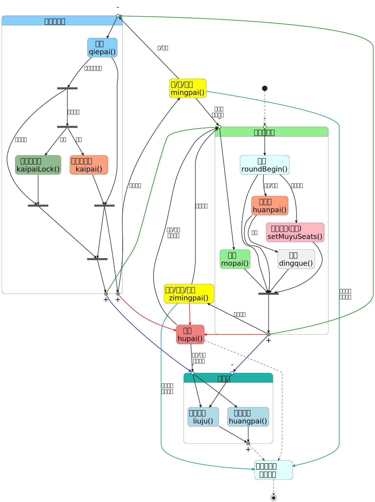
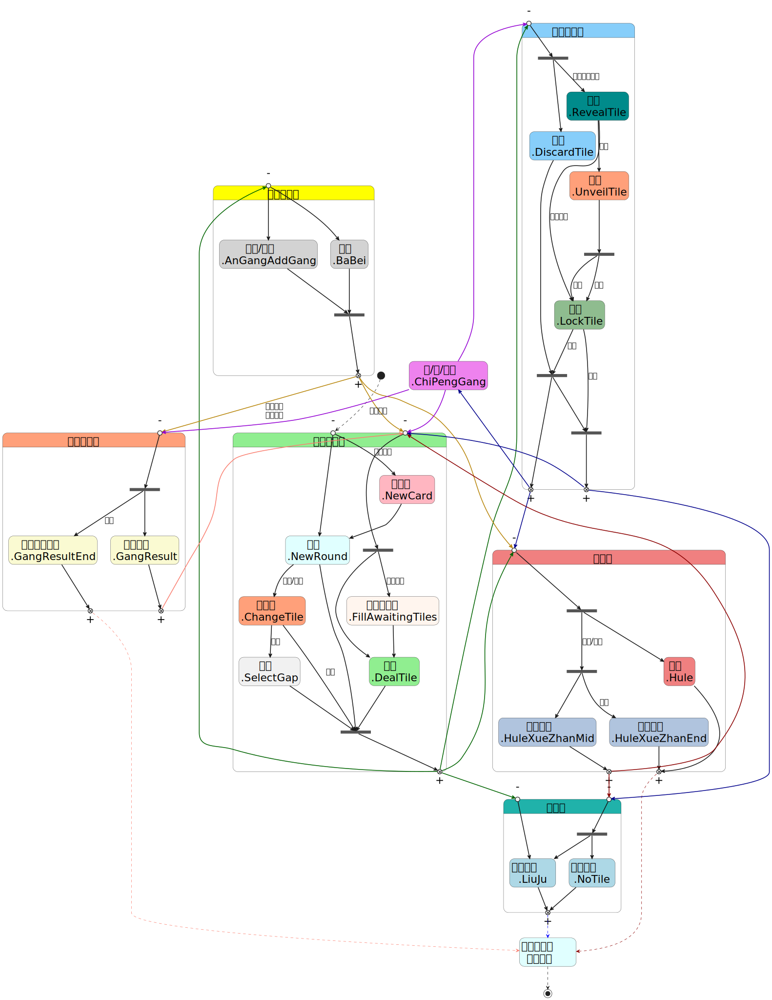

# 对局操作相关函数(活动场)

## 活动场操作状态转移表

官方函数版的图和代码在最后



## 目玉位置(龙之目玉): `muyuseats`

指定一小局目玉出现的位置顺序, 若顺序队列已用完, 则目玉位置随机刷新

例子: `muyuseats = '1230';`

## 换三张换牌(修罗/川麻): `huansanzhang(tls0, tls1, tls2, tls3, type)`

`tls0, tls1, tls2, tls3` : 表示四名玩家要交出去的三张牌

`type` : 0 表示逆时针换牌, 1 表示对家换牌, 2 表示顺时针换牌

例子: `huansanzhang('9p79s', '333s', '78p8s', '333z', 1);`

## 和牌(修罗/川麻): `hupai(allseats, type)`

与段位场相比多了个参数 `type`, 值为 `false` 表示中途和牌, `true` 表示最终和牌(使得该小局结束的和牌,
而不是玩家的最后和牌), 默认为中途和牌

例子: `hupai([0, 2, 3], true);` 和 `hupai(1);`

## 定缺(川麻): `dingque(gaps)`

`gaps` : 表示所有人的定缺花色, 四个字母从前到后分别代表 `seat` 从 0 到 3 的四名玩家

例子: `dingque('smps');`

## 开杠击飞(川麻): `mingpai(seat, tiles, jifei)` 和 `leimingpai(seat, tile, type, jifei)`

与段位场相比多了个参数 `jifei`, 与 `hupai` 类似, 在川麻中开杠刮风下雨导致玩家击飞也可以在这两个函数中输入参数 `true`, 表示完场

例子: `leimingpai(1, true);`

## 切牌(暗夜之战): `qiepai(seat, tile, is_liqi, anpai)`

与段位场相比多了个参数 `anpai`, 如果 `anpai` 的值是字符串 `'anpai'` 时, 在暗夜之战切牌会暗牌, 否则不会暗牌

例子: `qiepai(0, '7z', true, 'anpai');`

## 开牌并成功(暗夜之战): `unveil(seat)`

有人暗牌之后, 调用该函数可以使得 `seat` 号玩家开牌, 并且暗牌家没有锁定, 开牌成功

例子: `unveil(1);`

## 开牌后锁定(暗夜之战): `unveil_lock(seat)`

有人暗牌之后, 调用该函数可以使得 `seat` 号玩家开牌, 紧跟着暗牌家锁定, 开牌失败

例子: `unveil_lock(2);`

## 摸牌(占星之战): `mopai(seat, tile, index)`

与段位场相比多了个参数 `index`: 指在牌候选池中选择的牌位置, 没有该参数时默认选第一张牌

`[0]` 表示第一张牌, `[1]` 表示第二张牌, `[2]` 表示第三张牌

**注意: 为了区分 `index` 和 `seat` , 没有参数 `seat` 时, `index` 要表示为数组的形式,
如 `mopai([1])` 表示选择候选池中的第二张牌, 而不是 1 号玩家摸牌**

例子: `mopai(3, [2]);`

## 切牌(背水之战): `qiepai(seat, tile, is_liqi, bs_type)`

与段位场的切牌相比, 多了一个参数 `bs_type`, `bs_type` 的值可以是 `[0]`, `[1]`, `[2]`

`[0]` 表示普通立直, `[1]` 表示"真"系列, `[2]` 表示"极"系列, 默认为 `[0]`

例子: `qiepai(3, '1m', true, [2]);`

## svg 图和 plantuml 代码

### 官方版本的活动场操作状态转移表



### plantuml 代码

活动场操作状态转移表

```plantumlcode
@startuml 活动场操作状态转移表
hide empty description
scale 1.5
skinparam defaultTextAlignment center
skinparam defaultFontName "微软雅黑"
skinparam DefaultFontSize 20
skinparam State { 
    FontSize 28
}

State "广义摸牌组" as S000 #LightGreen {
    State "开局\nroundbegin()" as S1 #LightCyan
    State "摸牌\nmopai()" as S3 #LightGreen
    State "目玉位置(可选)\nmuyuseats" as S9 #LightPink
    State "换三张\nhuansanzhang()" as S10 #LightSalmon
    State "定缺\ndingque()" as S11

    S1 -[bold]-> S9 : 龙之目玉
    S1 -[bold]-> S10 : 修罗/川麻
    S10 -[bold]-> S11 : 川麻

    State "-" as S003 <<entryPoint>>
    S003 -[bold]-> S1

    State "-" as S001 <<entryPoint>>
    S001 -[bold]-> S3

    State "-" as S009 <<fork>>
    S1 -[bold]-> S009
    S3 -[bold]-> S009
    S9 -[bold]-> S009
    S10 -[bold]-> S009
    S11 -[bold]-> S009

    State "+" as S002 <<exitPoint>>
    S009 -[bold]-> S002
}
State "广义切牌组" as S040 #LightSkyBlue {
    State "切牌\nqiepai()" as S2 #LightSkyBlue
    State "开牌并成功\nunveil()" as S12 #LightSalmon
    State "开牌后锁定\nunveil_lock()" as S13 #DarkSeaGreen

    State "-" as S049 <<fork>>
    S2 -[bold]-> S049 : 暗夜之战暗牌
    State "-" as S048 <<fork>>
    S049 -[bold]-> S048 : 有人开牌
    S048 -[bold]-> S12 : 成功
    S048 -[bold]-> S13 : 锁定
    State "-" as S047 <<fork>>
    S2 -[bold]-> S047
    S12 -[bold]-> S047
    State "-" as S046 <<fork>>
    S13 -[bold]-> S046
    S049 -[bold]-> S046 : 无人开牌
    State "-" as S045 <<fork>>
    S047 -[bold]-> S045
    S046 -[bold]-> S045

    State "-" as S041 <<entryPoint>>
    S041 -[bold]-> S2
    
    ' 显牌
    State "+" as S042 <<exitPoint>>
    S047 -[bold]-> S042

    ' 锁牌
    State "+" as S043 <<exitPoint>>
    S045 -[bold]-> S043
}
State "流局组" as S050 #LightSeaGreen {
    State "途中流局\n.LiuJu" as S7 #LightBlue
    State "荒牌流局\n.NoTile" as S8 #LightBlue

    ' 切牌系
    State "-" as S051 <<entryPoint>>
    S051 -[bold]-> S7
    S051 -[bold]-> S8

    ' 摸牌系
    State "-" as S052 <<entryPoint>>
    S052 -[bold]-> S7

    State "+" as S053 <<exitPoint>>
    S7 -[bold]-> S053
    S8 -[bold]-> S053
}
State "本小局结束\n开始结算" as S0 #LightCyan
State "吃/碰/明杠\nmingpai()" as S4 #Yellow
State "暗杠/加杠/拔北\nleimingpai()" as S5 #Yellow
State "和牌\nhupai()" as S6 #LightCoral

[*] -[dashed]-> S003

' 广义摸牌组 出
S002 -[#green,bold]-> S041
S002 -[bold]-> S5 : 自家鸣牌
S002 -[#red,bold]-> S6
S002 -[#blue,bold]-> S052

' 广义切牌组 出
S042 -[bold]-> S4 : 他家鸣牌
S042 -[#red,bold]-> S6

S043 -[#green,bold]-> S001
S043 -[#blue,bold]-> S051

' 流局组 出
S053 -[dashed]-> S0

' 吃/碰/明杠 出
S4 -[bold]-> S041 : 吃/碰后
S4 -[bold]-> S001 : 明杠后\n岭上摸牌
S4 -[#DarkCyan,bold]-> S0 : 川麻刮风\n下雨击飞

' 暗杠/加杠/拔北 出
S5 -[bold]-> S001 : 岭上摸牌
S5 -[#red,bold]-> S6
S5 -[#DarkCyan,bold]-> S0 : 川麻刮风\n下雨击飞

' 和牌 出
S6 -[bold]-> S001 : 修罗/川麻\n途中和牌
S6 -[bold]-> S051 : 修罗/川麻\n途中和牌
S6 -[dashed]-> S0

' 终局
S0 -[dashed]-> [*]

@enduml
```

活动场操作状态转移表_官方分组版

```plantumlcode
@startuml 活动场操作状态转移表_官方分组版
hide empty description
scale 1.5
skinparam defaultTextAlignment center
skinparam defaultFontName "微软雅黑"
skinparam DefaultFontSize 20
skinparam State { 
    FontSize 28
}

State "广义摸牌组" as S000 #LightGreen {
    State "开局\n.NewRound" as S1 #LightCyan
    State "摸牌\n.DealTile" as S3 #LightGreen
    State "换三张\n.ChangeTile" as S10 #LightSalmon
    State "定缺\n.SelectGap" as S11
    State "翻卡片\n.NewCard" as S19 #LightPink
    State "候选池填充\n.FillAwaitingTiles" as S20 #SeaShell

    S19 -[bold]-> S1
    S1 -[bold]-> S10 : 修罗/川麻
    S10 -[bold]-> S11 : 川麻
    S20 -[bold]-> S3

    State "-" as S009 <<fork>>
    S1 -[bold]-> S009
    S10 -[bold]-> S009 : 修罗
    S11 -[bold]-> S009
    S3 -[bold]-> S009
    State "-" as S008 <<fork>>
    S008 -[bold]-> S3
    S008 -[bold]-> S20 : 占星之战

    State "-" as S001 <<entryPoint>> 
    S001 -[bold]-> S1
    S001 -[bold]-> S19 : 幻境传说

    State "+" as S002 <<exitPoint>>
    S009 -[bold]-> S002

    State "-" as S003 <<entryPoint>> 
    S003 -[bold]-> S008
}
State "自家鸣牌组" as S010 #Yellow {
    State "暗杠/加杠\n.AnGangAddGang" as S5 #LightGray
    State "拔北\n.BaBei" as S9 #LightGray

    State "-" as S019 <<fork>>
    S5 -[bold]-> S019
    S9 -[bold]-> S019

    State "-" as S011 <<entryPoint>>
    S011 -[bold]-> S5
    S011 -[bold]-> S9

    State "+" as S012 <<exitPoint>>
    S019 -[bold]-> S012
}
State "和牌组" as S020 #LightCoral {
    State "和牌\n.Hule" as S6 #LightCoral
    State "途中和牌\n.HuleXueZhanMid" as S12 #LightSteelBlue
    State "完场和牌\n.HuleXueZhanEnd" as S13 #LightSteelBlue
    

    State "-" as S029 <<fork>>
    S029 -[bold]-> S12
    S029 -[bold]-> S13 : 完场
    State "-" as S028 <<fork>>
    S028 -[bold]-> S029 : 修罗/川麻
    S028 -[bold]-> S6

    State "-" as S021 <<entryPoint>>
    S021 -[bold]-> S028

    ' 返回摸牌
    State "+" as S022 <<exitPoint>>
    S12 -[bold]-> S022

    ' 小局结束
    State "+" as S023 <<exitPoint>>
    S6 -[bold]-> S023
    S13 -[bold]-> S023
}
State "刮风下雨组" as S030 #LightSalmon {
    State "刮风下雨\n.GangResult" as S14 #LightGoldenRodYellow
    State "刮风下雨击飞\n.GangResultEnd" as S15 #LightGoldenRodYellow

    State "-" as S039 <<fork>>
    S039 -[bold]-> S14
    S039 -[bold]-> S15 : 击飞

    State "-" as S031 <<entryPoint>>
    S031 -[bold]-> S039

    ' 返回摸牌
    State "+" as S032 <<exitPoint>>
    S14 -[bold]-> S032

    ' 小局结束
    State "+" as S033 <<exitPoint>>
    S15 -[bold]-> S033
}
State "广义切牌组" as S040 #LightSkyBlue {
    State "切牌\n.DiscardTile" as S2 #LightSkyBlue
    State "暗牌\n.RevealTile" as S16 #DarkCyan
    State "锁牌\n.LockTile" as S17 #DarkSeaGreen
    State "开牌\n.UnveilTile" as S18 #LightSalmon

    S16 -[bold]-> S17 : 无人开牌
    S16 -[bold]-> S18 : 开牌
    State "-" as S049 <<fork>>
    S18 -[bold]-> S049
    S049 -[bold]-> S17 : 成功
    S049 -[bold]-> S17 : 锁定
    State "-" as S045 <<fork>>
    S045 -[bold]-> S16 : 暗夜之战暗牌
    S045 -[bold]-> S2
    State "-" as S047 <<fork>>
    S17 -[bold]-> S047 : 显牌
    S2 -[bold]-> S047

    State "-" as S046 <<fork>>
    S047 -[bold]-> S046
    S17 -[bold]-> S046 : 暗牌

    State "-" as S041 <<entryPoint>>
    S041 -[bold]-> S045

    ' 显牌
    State "+" as S042 <<exitPoint>>
    S047 -[bold]-> S042

    ' 锁牌
    State "+" as S043 <<exitPoint>>
    S046 -[bold]-> S043
}
State "流局组" as S050 #LightSeaGreen {
    State "途中流局\n.LiuJu" as S7 #LightBlue
    State "荒牌流局\n.NoTile" as S8 #LightBlue

    ' 切牌系
    State "-" as S059 <<fork>>
    S059 -[bold]-> S7
    S059 -[bold]-> S8

    State "-" as S051 <<entryPoint>>
    S051 -[bold]-> S059

    ' 摸牌系
    State "-" as S052 <<entryPoint>>
    S052 -[bold]-> S7

    State "+" as S053 <<exitPoint>>
    S7 -[bold]-> S053
    S8 -[bold]-> S053
}
State "本小局结束\n开始结算" as S0 #LightCyan
State "吃/碰/明杠\n.ChiPengGang" as S4 #Violet

[*] -[dashed]-> S001

' 广义摸牌组 出
S002 -[#DarkGreen,bold]-> S011
S002 -[#DarkGreen,bold]-> S021
S002 -[#DarkGreen,bold]-> S041
S002 -[#DarkGreen,bold]-> S052

' 自家鸣牌组 出
S012 -[#DarkGoldenRod,bold]-> S003
S012 -[#DarkGoldenRod,bold]-> S021
S012 -[#DarkGoldenRod,bold]-> S031 : 川麻暗杠\n摸牌加杠

' 和牌组 出
S022 -[#DarkRed,bold]-> S003
S022 -[#DarkRed,bold]-> S051

S023 -[#DarkRed,dashed]-> S0

' 刮风下雨组 出
S032 -[#Salmon,bold]-> S003

S033 -[#Salmon,dashed]-> S0

' 广义切牌组 出
S042 -[#DarkBlue,bold]-> S4
S042 -[#DarkBlue,bold]-> S021

S043 -[#DarkBlue,bold]-> S003
S043 -[#DarkBlue,bold]-> S051

' 吃/碰/明杠 出
S4 -[#DarkViolet,bold]-> S003
S4 -[#DarkViolet,bold]-> S031 : 川麻明杠
S4 -[#DarkViolet,bold]-> S041

' 终局
S053 -[#Blue,dashed]-> S0
S0 -[dashed]-> [*]

@enduml
```