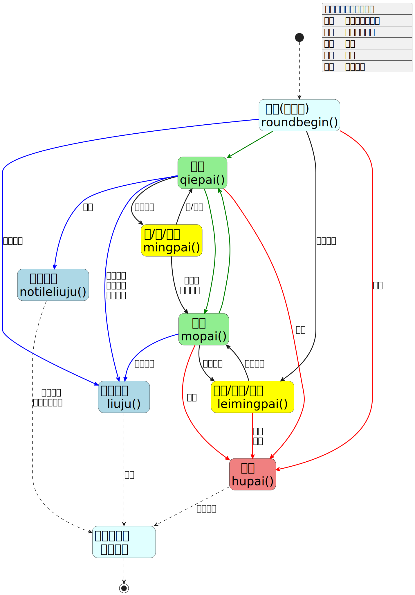
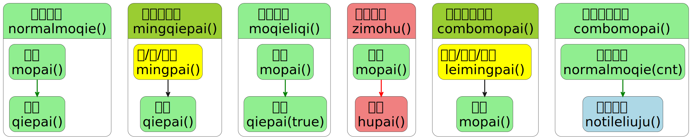
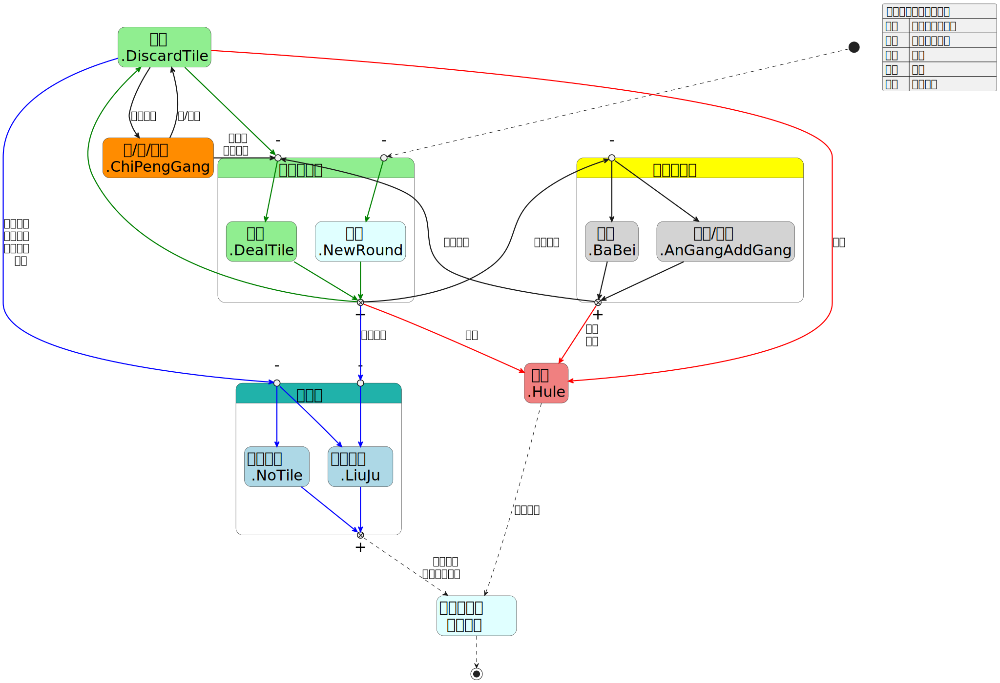

# Operation Functions (Play-by-Play Helpers)

**Updated on January 3, 2026**

## Ranked (Rank-match) operation state transition diagram

This diagram is an SVG generated with PlantUML. The official-function version and source are included at the end of this file.



## Draw tile (Deal)

`mopai(seat, tile)` — the argument order is flexible.

`seat`: the seat index of the player drawing; if omitted the engine will determine who draws. Whether the draw is a rinshan draw is also determined automatically.

If the engine cannot determine who should draw, an error will be logged to the console.

`tile`: the tile to draw; if omitted the tile will be determined from the wall.

The actual drawn tile is resolved in the following priority order:

1. The tile explicitly supplied to `tile`.
2. The draw sequence supplied by `setDealTiles` for that `seat`.
3. The tile inferred from the wall (paishan).

Note: If you explicitly set `tile`, the drawn tile may not match the wall (simulating an external tile swap), but this breaks replay integrity and prevents correct validation of tile counts.

Examples: `mopai(1);` and `mopai('1z');`

## Discard (qiepai)

`qiepai(seat, tile, is_liqi, f_moqie)` — the argument order is flexible.

`seat`: the seat index of the player discarding; if omitted the engine will determine who discards.

`tile`: the tile to discard; if omitted the discard is treated as a draw-and-discard.

When a tile could be either a hand-discard or a draw-discard:

- If the tile comes from `setDiscardTiles`, it is treated as a draw-discard.
- If not from `setDiscardTiles`, explicitly passing `tile` means a hand-discard; omitting `tile` means a draw-discard.

The actual discarded tile is resolved in this priority order:

1. The tile explicitly supplied to `tile`.
2. The discard sequence supplied by `setDiscardTiles` for that `seat`.
3. A draw-discard (the last drawn tile).

If the engine determines the discarder does not have the specified `tile`, an error will be logged to the console.

`is_liqi`: whether this discard is a Riichi declaration (`true` or `false`). The engine detects double-Riichi automatically. If the parameter value is the string `'kailiqi'` it indicates an "open riichi" (requires importing `add_function.js`). If omitted, the default is no Riichi.

When `_fufenliqi` is not set in `detail_rule`, setting `is_liqi` to `true` with insufficient points will make the Riichi attempt fail.

`f_moqie`: used only in the "heqie" mode (when `_heqie_mode` is set in `detail_rule`). If set to `'moqie'` it forces a draw-discard display.

Examples: `qiepai('0m', true);` and `qiepai(3);`

## Calling tiles (Chi / Pon / Meld/Gang by other players)

`mingpai(seat, tiles)` — the argument order is flexible.

Chi/Pon/open-Gang are reactions performed after another player draws and discards.

`seat`: the seat index of the player making the call; if omitted the engine will determine which player is calling.

`tiles`: the tiles the caller takes from their hand; if omitted the engine will decide in the order: open-gang, pon, chi — and will prefer red-dora/special tiles where applicable.

If no player can legally call, an error will be logged to the console.

Examples: `mingpai(3, '46m');` and `mingpai('055s');`

## Calling on self-draw (concealed gang / added gang / ba-Bei)

`zimingpai(seat, tile, type)` — the argument order is flexible.

Concealed gang (ankan), added gang (kakan), and ba-bei are calls performed after the player's own draw.

`seat`: the seat index of the player performing the action; if omitted the engine will determine who acts.

`tile`: the tile for the ankan/kakan/ba-bei; if omitted the engine will decide in the order: ba-bei, ankan, kakan.

`type`: the explicit operation type — `'angang'`, `'jiagang'`, or `'babei'`. If omitted the engine decides in the order: ba-bei, ankan, kakan.

If the player cannot perform `zimingpai`, an error will be logged.

Examples: `zimingpai(0, '1m');` and `zimingpai('4z', 'angang');`

## Win (hupai)

`hupai(seats)` — the argument order is flexible.

Declare wins for the players listed in `seats`. If omitted the engine will determine which players can win.

If only one player wins, `seats` may be provided as a single number.

If `seats` is omitted and in the case of ron-by-steal (ronghu) no player can legally win, an error will be logged.

When multiple players can claim the same discard (ron), and head-jump rules are enabled, only the player closest to the discarder in turn order wins.

Examples: `hupai(0);` and `hupai([1, 2, 3]);`

Behavior for no-yaku, furiten (ron blocked) and non-winning hands:

- For self-draw wins (tsumo), invoking this function will force the player to win regardless of legality. If the hand has no yaku or is otherwise invalid, it will be treated as a false win (zha-hu / fake win).
- For ron wins (ronghu):
  - If `seats` is omitted, players without yaku or players who are in furiten cannot win.
  - If `seats` is provided, the engine will decide whether the win is a false win based on whether players listed in `seats` can actually win.

Two global modifiers in `detail_rule` affect ronghu handling:

- `_ronghuzhahu`: if `true`, then when `seats` is omitted, players who are in tenpai but have no yaku will still be allowed to win but it will be treated as a false win. Default: `false`.
- `_no_zhenting`: if `true`, disables furiten checks and allows furiten players to win normally with full scoring. Default: `false`.

## Exhaustive draw (no tiles) — Draw game

`huangpai()`

You can call this even if the wall is not fully consumed (it is allowed in almost any situation).

## Abortive draw types (liuju)

`liuju(liuju_type)`

`liuju_type` indicates the abortive draw type:

- 1: Nine terminals and honors (九种九牌)
- 2: Four identical winds in succession (四风连打)
- 3: Four kans (four kongs dispersed) (四杠散了)
- 4: Four players riichi (四家立直)
- 5: Three players won simultaneously (三家和了) — requires `_sanxiangliuju` enabled in `detail_rule`

If omitted, the engine will automatically choose the abortive type except for the "three players won" case which currently must be invoked with an explicit parameter.

If multiple abortive conditions are satisfied at once, priority is: Four identical winds > Four kans dispersed > Four players riichi.

For the first four types, whether the abortive draw will take effect depends on whether the specific condition is actually met; otherwise it will not take effect and an error will be logged.

---

## Jump to a specific round

`setRound(c, j, b)`

Jump to the specified round. The three parameters correspond to `chang`, `ju`, `ben` (explained earlier in `randomPaishan`).

For example, to jump from East-1 to South-1 immediately after East-1 ends, call `setRound(1, 0, 0);`.

Note: this function cannot change the initial round when the replay is first loaded. To change the first displayed round use the `detail_rule` option `_chang_ju_ben_num_`. For example, `_chang_ju_ben_num_ = [1, 3, 5]` means the first shown round is South-4 with 5 honba.

## Remaining tiles in the wall

`getLeftTileCnt()`

Returns how many tiles are left to draw at the current position.

There are also a few special starting remaining-tile values shown for particular modes:

- 69: 4-player rank match
- 54: 3-player rank match
- 55: Akaba battle (赤羽之战)
- 83: Guobiao (Chinese National Standard) Mahjong
- 35: Two-player mahjong

## Special helper: demo game

`demoGame()`

Used in the preset templates (under `products/预设模版`) to show example hands. The function adapts to `config` settings to pick the correct player count.

---

## Quick-reference helper functions



## Helper: normal draw-and-discard

`normalMoqie(tile_cnt)`

This helper loops `mopai()` and `qiepai()` and is useful for many successive draw-and-discard actions. `tile_cnt` indicates either the tile to discard after drawing or the number of loop iterations.

If `tile_cnt`:

- is a tile string like `'1p'`, it is used as the `tile` argument for `qiepai()` (example: `normalMoqie('1p');`).
- is a number, it indicates the number of `mopai()`/`qiepai()` iterations (example: `normalMoqie(2);`).
- is omitted, it's treated like `1`.

Use this with `setDiscardTiles` to avoid long repetitive manual discards when no calls are made.

## Helper: draw-and-Riichi

`moqieLiqi(tile_cnt)`

This helper loops `mopai()` and `qiepai(true)`; the meaning of `tile_cnt` is the same as in `normalMoqie`.

## Helper: consecutive rinshan draws

`comboMopai(tile_cnt)`

Used for consecutive rinshan draws. It loops `zimingpai()` and `mopai()`. `tile_cnt` is as above.

Because `zimingpai()` checks in the order ba-bei > ankan > kakan, do not use this helper if you need a specific gang order.

Examples: `comboMopai(4);` for four consecutive kongs; `comboMopai('1z');` to kong the East wind and draw.

Note: this helper ends with a `mopai()` call, so the next function should not be `normalMoqie` because that will call `mopai()` again and cause an extra draw.

## Helper: call and then discard

`mingQiepai(tls_cnt)`

Loops `mingpai()` and `qiepai()`. `tls_cnt` has broader meanings than `tile_cnt` above.

If `tls_cnt`:

- is a single tile (like `'1p'`), it is the `tile` argument for `qiepai()`.
- is two or more tiles (like `'23m'`), it is the `tiles` argument for `mingpai()` (the tiles the caller takes from their hand), e.g. `mingQiepai('35m');`.
- is a number, it indicates how many times to loop `mingpai()` + `qiepai()`.
- is omitted, it's treated like `1`.

The loop count here denotes multi-player combo calls.

Because `mingpai()` is followed by `qiepai()`, `mingpai()` here can only be chi or pon, not an open gang.

Since `mingpai()` without parameters will check in the order open-gang > pon > chi (and pon/chi may have ambiguity), don't use this helper if you need precise control.

Also `qiepai()` is often specified, so `setDiscardTiles` is typically used together with this helper.

## Helper: self-draw win

`zimoHu(flag)`

Loops `mopai()` and `hupai()`. `flag` is optional and used in Shura/Akaba modes to indicate whether this is the final winning tile (`true` or `false`). Default: `false`.

## Helper: draw-and-discard until exhaustive draw

`moqieLiuju()`

Equivalent to `normalMoqie(cnt)` followed by `huangpai()`, where `cnt` is `getLeftTileCnt()`.

## SVG diagrams and PlantUML source

### Official-version ranked match operation state transition diagram




### PlantUML source

Ranked match operation state transition diagram

```plantumlcode
@startuml 段位场操作状态转移表
hide empty description
scale 1.5
skinparam defaultTextAlignment center
skinparam defaultFontName "微软雅黑"
skinparam DefaultFontSize 20
skinparam State { 
    FontSize 28
}

State "开局(庄行动)\nroundBegin()" as S1 #LightCyan
State "切牌\nqiepai()" as S2 #LightGreen
State "摸牌\nmopai()" as S3 #LightGreen
State "吃/碰/明杠\nmingpai()" as S4 #Yellow
State "暗杠/加杠/拔北\nzimingpai()" as S5 #Yellow
State "和牌\nhupai()" as S6 #LightCoral
State "荒牌流局\nhuangpai()" as S7 #LightBlue
State "途中流局\nliuju()" as S8 #LightBlue
State "本小局结束\n开始结算" as S9 #LightCyan

[*] -[dashed]-> S1

' 绿线: 无人鸣牌的流程
S1 -[#green,bold]-> S2
S2 -[#green,bold]-> S3
S3 -[#green,bold]-> S2

' 黑线: 鸣牌相关流程
S1 -[bold]-> S5 : 自家鸣牌

S2 -[bold]-> S4 : 他家鸣牌
S4 -[bold]-> S2 : 吃/碰后
S4 -[bold]-> S3 : 明杠后\n岭上摸牌

S3 -[bold]-> S5 : 自家鸣牌
S5 -[bold]-> S3 : 岭上摸牌

' 红线: 和牌
S1 -[#red,bold]-> S6 : 天和
S2 -[#red,bold]-> S6 : 放铳
S3 -[#red,bold]-> S6 : 自摸
S5 -[#red,bold]-> S6 : 枪杠\n枪北

' 蓝线: 流局
S2 -[#blue,bold]-> S7 : 荒牌
S2 -[#blue,bold]-> S8 : 四风连打\n四杠散了\n四家立直
S1 -[#blue,bold]-> S8 : 九种九牌
S3 -[#blue,bold]-> S8 : 九种九牌

' 终局
S6 -[dashed]-> S9 : 连庄判断
S7 -[dashed]-> S9 : 连庄判断\n流局满贯判断
S8 -[dashed]-> S9 : 连庄
S9 -[dashed]-> [*]

json 段位场操作状态转移表 {
    "绿线": "无人鸣牌的流程",
    "黑线": "鸣牌相关流程",
    "红线": "和牌",
    "蓝线": "流局",
    "虚线": "过渡流程"
}
@enduml
```

Quick-reference helpers

```plantumlcode
@startuml 便捷函数一览
hide empty description
scale 1.5
skinparam defaultTextAlignment center
skinparam defaultFontName "微软雅黑"
skinparam DefaultFontSize 20
skinparam State { 
    FontSize 28
}

State "正常摸切\nnormalMoqie()" as S1 #LightGreen {
    State "切牌\nqiepai()" as S12 #LightGreen
    State "摸牌\nmopai()" as S11 #LightGreen
    S11 -[#green,bold]-> S12
}

State "摸牌立直\nmoqieLiqi()" as S2 #LightGreen {
    State "摸牌\nmopai()" as S21 #LightGreen
    State "切牌\nqiepai(true)" as S22 #LightGreen
    S21 -[#green,bold]-> S22
}

State "连续岭上摸牌\ncomboMopai()" as S3 #YellowGreen {
    State "暗杠/加杠/拔北\nzimingpai()" as S31 #Yellow
    State "摸牌\nmopai()" as S32 #LightGreen
    S31 -[bold]-> S32
}

State "鸣牌并切牌\nmingQiepai()" as S4 #YellowGreen {
    State "吃/碰/明杠\nmingpai()" as S41 #Yellow
    State "切牌\nqiepai()" as S42 #LightGreen
    S41 -[bold]-> S42
}

State "自摸和牌\nzimoHu()" as S5 #LightCoral {
    State "摸牌\nmopai()" as S51 #LightGreen
    State "和牌\nhupai()" as S52 #LightCoral
    S51 -[#red,bold]-> S52
}

State "摸切到荒牌流局\nmoqieLiuju()" as S6 #LightGreen {
    State "正常摸切\nnormalMoqie(cnt)" as S61 #LightGreen
    State "荒牌流局\nhuangpai()" as S62 #LightBlue
    S61 -[#green,bold]-> S62
}
@enduml
```

Official ranked-match operation diagram (functions version)

```plantumlcode
@startuml 段位场操作状态转移表_官方版
hide empty description
scale 1.5
skinparam defaultTextAlignment center
skinparam defaultFontName "微软雅黑"
skinparam DefaultFontSize 20
skinparam State { 
    FontSize 28
}

State "本小局结束\n开始结算" as S0 #LightCyan
State "开局\n.NewRound" as S1 #LightCyan
State "切牌\n.DiscardTile" as S2 #LightGreen
State "摸牌\n.DealTile" as S3 #LightGreen
State "吃/碰/明杠\n.ChiPengGang" as S4 #Darkorange
State "暗杠/加杠\n.AnGangAddGang" as S5 #Yellow
State "和牌\n.Hule" as S6 #LightCoral
State "途中流局\n.LiuJu" as S7 #LightBlue
State "荒牌流局\n.NoTile" as S8 #LightBlue
State "拔北\n.BaBei" as S9 #Yellow

[*] -[dashed]-> S1

' 绿线: 无人鸣牌的流程
S1 -[#green,bold]-> S2
S2 -[#green,bold]-> S3
S3 -[#green,bold]-> S2
```
