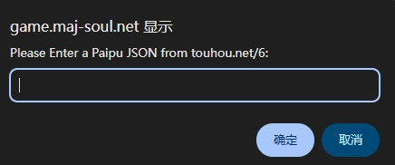

# 天凤牌谱编辑器数据转雀魂格式

## 获取天凤牌谱JSON数据

如果已有 json 数据, 可以跳至下一步

打开 [天凤牌谱编辑器](https://tenhou.net/6/) 手动制作牌谱,
或使用仓库 [根据可见手牌和牌河生成天凤牌谱](https://github.com/wuye999/tenhou)

如果是手动制作, 编辑完成后点击 EDIT AS TEXT, 弹出的对话框里面文本就是 json 数据

## 将数据加载到雀魂中

1. 登录网页版雀魂, F12 打开控制台
2. 载入 [main.js](../../main.js),
3. 再输入 [touhou_json_2_majsoul.js](touhou_json_2_majsoul.js),
4. 会弹出和天风类似的对话框, 将 json 数据输入进去, 牌谱即加载完成
5. 随便选择一个谱查看, 即可放映和天凤界面几乎一样的牌谱

