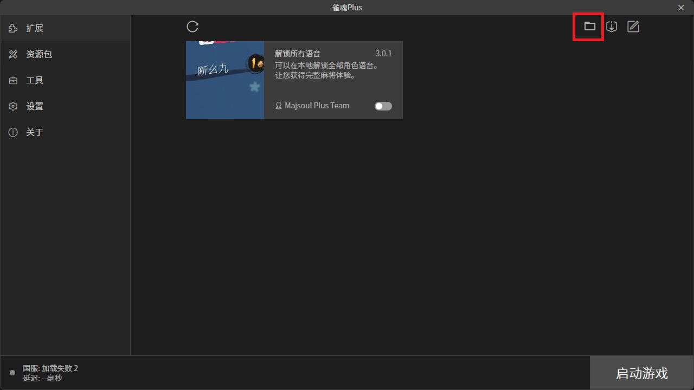
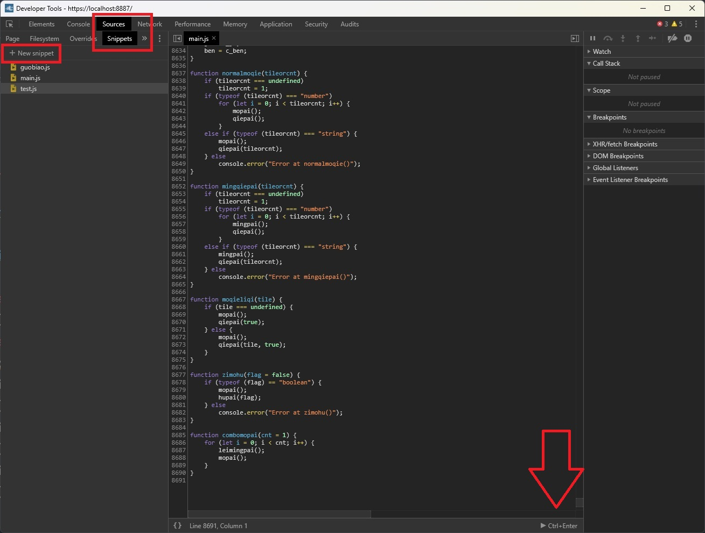
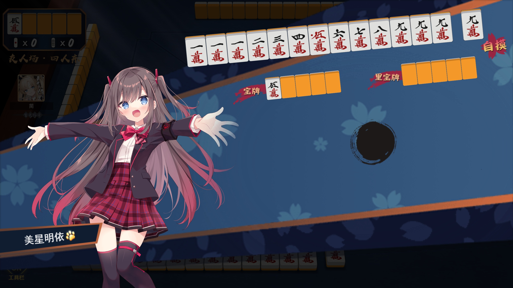

# 使用雀魂Plus更改角色立绘为第三方立绘

1. 下载并安装该issue下版本的雀魂Plus: https://github.com/MajsoulPlus/majsoul-plus/pull/128#issuecomment-873089143

2. 运行雀魂Plus, 点击下图红框的按钮, 弹出 extension 目录, 返回到上一级雀魂Plus目录, 找到 static 文件夹进入

   

3. 启动游戏登录小号, 在仓库中查看你要被替换的立绘(以"八木唯-异想烂漫"为例), 然后关闭重新打开雀魂Plus
    - 注意: 要被替换的立绘和新立绘最好尺寸比例差不多(新立绘可以裁剪), 否则会拉伸变形,
      "八木唯-异想烂漫"的长宽大约是最接近1:1的

4. 替换立绘(由于雀魂Plus的替换立绘功能失效了, 这里只能手动替换,
   详见: https://github.com/MajsoulPlus/majsoul-plus/issues/158)
    1) 转到上面 static 文件夹, 进入 "0" 文件夹, 下面有很多后缀为 "w" 的文件夹, 通过搜索角色拼音的方式找到你要替换立绘的文件位置
    2) "八木唯-异想烂漫"在 `\v0.11.82.w\lang\base\extendRes\charactor\bamuwei_SLO`, 将该位置添加到地址栏后面, 可以直接定位
    3) 上面第3步查看立绘成功的话, 该 bamuwei_SLO 目录下有个 `full.png` 的文件, 这个就是"八木唯-异想烂漫"的全身立绘文件,
       换成你的立绘

5. 雀魂Plus启动游戏, 查看含有被替换立绘的牌谱, 到该角色报菜名界面, 即可查看到立绘改变
    - 注意头像的角色没有变化, 因为头像用的是另一个图片名 `smallhead.png`, 如无需求可以不改,
    - 更换立绘不需要重启游戏, 但需要注意备份, 或者使用完毕结束后删除你的文件, 后面会重新下载

6. 自制牌谱部分: 雀魂Plus也有类似网页浏览器F12的调试, 通过热键 `Ctrl + Shift + I` 调出调试窗口,
   不过直接在 console 中粘贴像 main.js 比较长的脚本会卡住没反应, 这里推荐另一种方法
    1) 调试窗口转到 Sources 界面, 左侧有一栏, 有个 Snippets, 如果没有可以点 ">>" 显示, 点到该栏, 然后 "New snippets"
    2) 这个相当于新建一个小抄, 可以很方便的存储像 main.js 这种常用脚本, 小抄命名也可以同步
    3) 点击下面偏右的 `Ctrl+Enter` 可以运行对应的小抄, 运行之后下面会弹出 console 的小窗口
    4) 对于比较短的脚本仍然可以选择直接粘贴到 console 中

   

   

上图立绘来源: https://jp.msi.com/Landing/mihoshimei/nb

更多第三方立绘展示详见我的B站动态: [把其他立绘搬到雀魂中](https://www.bilibili.com/opus/1056869246845321238)

## 其他相关文档

[报菜名界面加入无法显示的汉字](报菜名界面加入无法显示的汉字.md)
